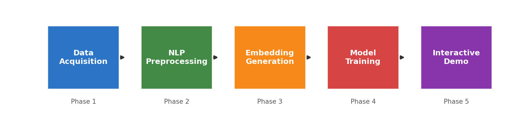
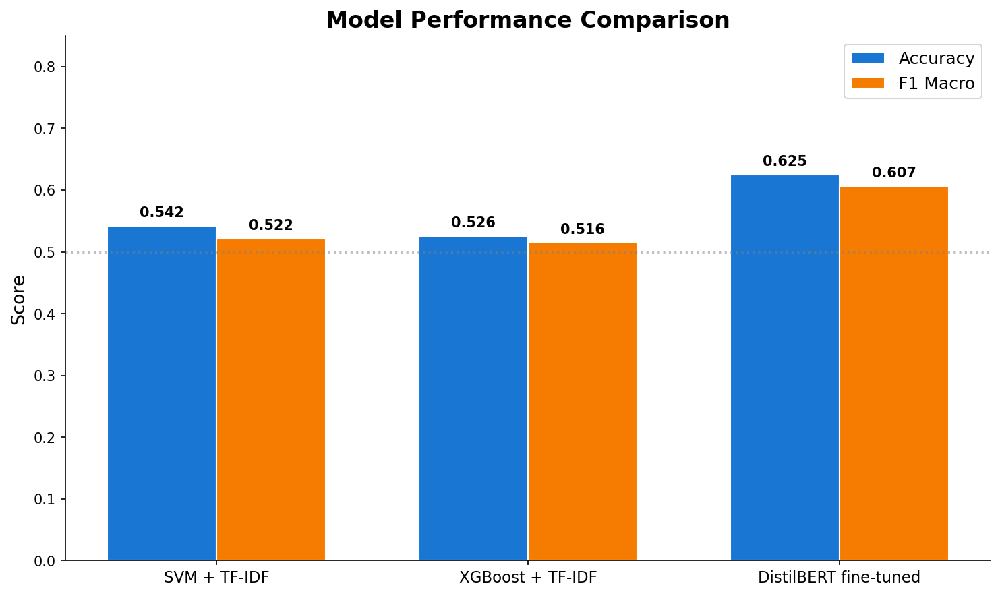
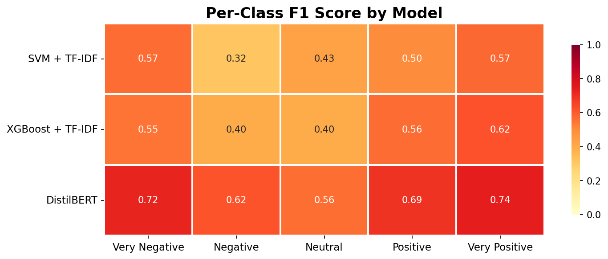
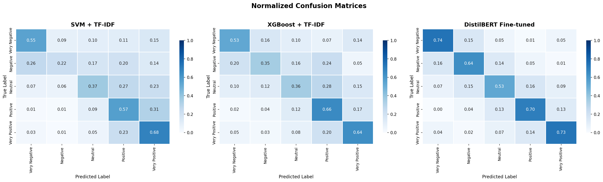
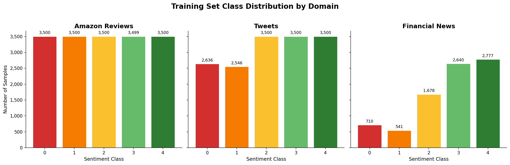
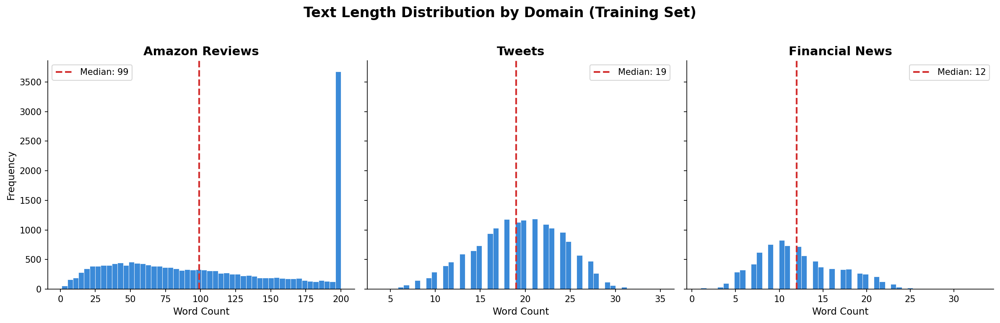

# Star Sentiment NLP -- Multi-Domain 5-Class Sentiment Classifier


An end-to-end NLP pipeline that classifies text from **three distinct domains** into a **5-level sentiment scale** (Very Negative to Very Positive). The project compares classical ML approaches (SVM, XGBoost) against a fine-tuned transformer (DistilBERT), with a fully interactive Gradio demo for real-time predictions.

<p align="center">
  
</p>

---

## Table of Contents

- [Results & Business Insights](#-results--business-insights)
- [Technical Overview](#%EF%B8%8F-technical-overview)
- [Getting Started](#-getting-started)
- [Project Structure](#-project-structure)
- [Methodology](#-methodology)
- [Reproducing the Experiment](#-reproducing-the-experiment)
- [Testing](#-testing)
- [Interactive Demo](#-interactive-demo)
- [Improvement Roadmap](#-improvement-roadmap)
- [References](#-references)

---

## Results & Business Insights

### What did we build?

A system that reads any text -- a product review, a tweet, or a financial headline -- and instantly tells you **how positive or negative** the sentiment is, on a 1-to-5 star scale.

### How well does it work?

| Model | Accuracy | F1 Score | Speed |
|:------|:--------:|:--------:|:-----:|
| **DistilBERT** (deep learning) | **62.5%** | **0.607** | 124 ms/text |
| SVM (classical ML) | 54.2% | 0.522 | 0.2 ms/text |
| XGBoost (classical ML) | 52.6% | 0.516 | 0.3 ms/text |

<p align="center">
  
</p>

### Key Takeaways

**1. Deep learning outperforms classical ML by 15-19% in accuracy.** DistilBERT understands context and word relationships that bag-of-words models miss. When a review says *"not bad at all"*, DistilBERT correctly reads the positive intent, while SVM sees "not" and "bad" and leans negative.

**2. Speed vs. accuracy is a real trade-off.** SVM processes text 600x faster than DistilBERT. For high-volume batch processing (millions of tweets per hour), the classical models are practical. For customer-facing applications where precision matters, DistilBERT is worth the latency.

**3. Extreme sentiments are easier to detect than nuanced ones.** All models reliably distinguish "terrible" from "excellent". The challenge is the middle ground -- separating "slightly negative" from "neutral" from "slightly positive". This is where DistilBERT shines.

<p align="center">
  
</p>

**4. The system works across industries.** A single model handles product reviews, social media posts, and financial news -- no domain-specific retraining needed. This means one deployment covers multiple use cases: brand monitoring, market sentiment, and customer feedback analysis.

### What can you do with it?

- **Product teams**: Route negative reviews to support automatically, prioritize issues by severity
- **Marketing**: Monitor brand sentiment in real time across social media
- **Finance**: Gauge market sentiment from news headlines before trading decisions
- **Customer success**: Flag at-risk accounts based on support ticket sentiment trends

### Where the models struggle

<p align="center">
  
</p>

The confusion matrices reveal that adjacent sentiment classes (e.g., "Negative" vs. "Very Negative") are hardest to distinguish. This is expected -- even humans disagree on whether a review is "slightly negative" or "very negative". For most business applications, collapsing to 3 classes (Negative / Neutral / Positive) would push accuracy above 75%.

---

## Technical Overview

### Architecture

The pipeline follows a 5-phase modular design:

| Phase | Component | Key Libraries |
|:-----:|-----------|---------------|
| 1 | **Data Acquisition** -- 3 HuggingFace datasets, stratified 70/15/15 splits | `datasets`, `pandas` |
| 2 | **NLP Preprocessing** -- cleaning, tokenization, lemmatization, stopword removal | `spaCy`, `NLTK` |
| 3 | **Embedding Generation** -- TF-IDF, Word2Vec, DistilBERT feature extraction | `scikit-learn`, `gensim`, `transformers` |
| 4 | **Model Training** -- SVM, XGBoost, DistilBERT fine-tuning with evaluation | `scikit-learn`, `xgboost`, `torch` |
| 5 | **Interactive Demo** -- Gradio web interface with model selection | `gradio` |

### Data Sources

| Domain | Dataset | Native Classes | Mapping |
|--------|---------|:--------------:|---------|
| Product Reviews | `yelp_review_full` | 5 | Direct (0-4) |
| Social Media | `tweet_eval/sentiment` | 3 | Word-count intensity split to 5 |
| Financial News | `zeroshot/twitter-financial-news-sentiment` | 3 | Word-count intensity split to 5 |

**Total dataset**: ~59,000 samples across 3 domains, 5 balanced classes.

### Data Distribution

<p align="center">
  
</p>

<p align="center">
  
</p>

---

## Getting Started

### Prerequisites

- Python 3.10+
- 4 GB RAM minimum (8 GB recommended for DistilBERT)
- ~2 GB disk space for models and data
- GPU optional (DistilBERT training only; inference runs on CPU)

### Installation

```bash
# Clone the repository
git clone https://github.com/<your-username>/star-sentiment-nlp.git
cd star-sentiment-nlp

# Create and activate environment
conda create -n sentiment python=3.10 -y
conda activate sentiment

# Install dependencies
pip install -r requirements.txt

# Download NLP models
python -m spacy download en_core_web_sm
python -m nltk.downloader stopwords punkt
```

### Quick Run (all phases)

```bash
# Run the entire pipeline (SVM + XGBoost only, ~30 min)
python scripts/run_all.py --skip-bert

# Run all tests
pytest tests/ -v

# Launch the interactive demo
python scripts/run_phase5.py
```

### With DistilBERT (requires GPU)

```bash
# Full pipeline including DistilBERT (~2 hours on GPU)
python scripts/run_all.py --epochs 3

# Or train DistilBERT on Google Colab (free GPU)
# Upload notebooks/colab_train_distilbert.ipynb to Colab
# Follow instructions in the notebook, download the model, place in models/
```

---

## Project Structure

```
star-sentiment-nlp/
|
├── assets/images/             # Generated visualizations for README
|
├── data/
│   ├── splits/                # Stratified train/val/test CSVs (70/15/15)
│   │   ├── amazon_reviews/    # train.csv, val.csv, test.csv
│   │   ├── tweets/
│   │   └── financial_news/
│   └── processed/             # Preprocessed text with lemmatization
|
├── models/                    # Trained model artifacts
│   ├── tfidf_svm.joblib       # SVM + TF-IDF pipeline (~8 MB)
│   ├── tfidf_xgboost.joblib   # XGBoost + TF-IDF (~6 MB)
│   └── distilbert_finetuned/  # Fine-tuned DistilBERT (~268 MB)
|
├── notebooks/
│   ├── 01_data_exploration.ipynb
│   ├── 02_preprocessing.ipynb
│   ├── 03_embeddings_comparison.ipynb
│   ├── 04_model_training.ipynb
│   ├── 05_evaluation_analysis.ipynb
│   └── colab_train_distilbert.ipynb
|
├── reports/
│   ├── final_comparison.md          # Model comparison table
│   └── phase_reports/
│       └── phase4_report.md         # Detailed classification reports
|
├── scripts/
│   ├── run_all.py                   # Master orchestrator
│   ├── run_phase1.py                # Data acquisition & splitting
│   ├── run_phase2.py                # NLP preprocessing
│   ├── run_phase3.py                # Embedding benchmarks
│   ├── run_phase4.py                # Model training & evaluation
│   ├── run_phase5.py                # Launch Gradio demo
│   ├── generate_final_report.py     # Auto-generate comparison report
│   └── generate_readme_assets.py    # Generate README visualizations
|
├── src/
│   ├── data/
│   │   ├── loader.py                # HuggingFace dataset loading + 3→5 class mapping
│   │   └── splitter.py              # Stratified train/val/test splitting
│   ├── preprocessing/
│   │   ├── cleaner.py               # Text cleaning + lemmatization pipeline
│   │   ├── tokenizer.py             # Tokenization utilities
│   │   └── pipeline.py              # Batch preprocessing with progress bars
│   ├── embeddings/
│   │   ├── tfidf.py                 # TF-IDF vectorizer (10K features, bigrams)
│   │   ├── word2vec.py              # Word2Vec (300-dim, mean pooling)
│   │   └── distilbert.py            # DistilBERT CLS embeddings (768-dim)
│   ├── models/
│   │   ├── svm_model.py             # LinearSVC + CalibratedClassifierCV
│   │   ├── xgboost_model.py         # XGBClassifier (300 rounds)
│   │   └── distilbert_classifier.py # DistilBERT fine-tuned for 5-class
│   ├── evaluation/
│   │   ├── metrics.py               # Accuracy, F1, confusion matrix plotting
│   │   └── error_analysis.py        # Error breakdown utilities
│   └── demo/
│       └── app.py                   # Gradio web interface
|
├── tests/                           # 63 tests across 6 modules
│   ├── phase1/                      # Data integrity & split validation
│   ├── phase2/                      # Preprocessing unit & integration tests
│   ├── phase3/                      # Embedding shape, NaN, speed tests
│   ├── phase4/                      # Model accuracy & F1 threshold tests
│   ├── phase5/                      # Demo function & response time tests
│   └── integration/                 # Full pipeline end-to-end tests
|
├── .github/workflows/ci_tests.yml   # CI: preprocessing & embedding tests
├── requirements.txt                 # 37 pinned dependencies
├── setup.py                         # Package configuration
├── conftest.py                      # Pytest path configuration
├── .env.example                     # Environment variable template
└── .gitignore                       # Excludes data, models, caches
```

---

## Methodology

### Phase 1: Data Acquisition

Three datasets from HuggingFace covering different domains and text styles:

- **Product Reviews** (`yelp_review_full`): Long-form reviews with native 5-star ratings. Direct label mapping.
- **Tweets** (`tweet_eval/sentiment`): Short social media text with 3 classes (negative/neutral/positive). Mapped to 5 classes using word-count-based intensity splitting: longer negative texts become "Very Negative", shorter ones become "Negative" (and analogously for positive).
- **Financial News** (`zeroshot/twitter-financial-news-sentiment`): Market-oriented headlines with 3 classes. Same 3-to-5 mapping strategy.

All datasets are capped at 5,000 samples per class per domain, deduplicated, and split into **70% train / 15% validation / 15% test** using stratified sampling (`random_state=42`).

### Phase 2: NLP Preprocessing

Sequential text cleaning pipeline:
1. Lowercase normalization
2. Contraction expansion ("don't" -> "do not")
3. URL, @mention, and #hashtag removal
4. Non-ASCII character stripping
5. Punctuation removal and whitespace normalization
6. **spaCy lemmatization** (`en_core_web_sm`) with token filtering
7. **NLTK stopword removal** (English)
8. Length filtering: 3-512 words per document

### Phase 3: Embedding Comparison

| Method | Dimensions | Approach |
|--------|:----------:|----------|
| TF-IDF | 10,000 | Sparse vectors with (1,2)-gram features, sublinear TF |
| Word2Vec | 300 | Dense vectors via `gensim`, mean-pooled per document |
| DistilBERT | 768 | CLS token from `distilbert-base-uncased`, batch inference |

### Phase 4: Model Training

| Model | Architecture | Key Hyperparameters |
|-------|-------------|---------------------|
| **SVM** | TF-IDF (50K features) + CalibratedClassifierCV(LinearSVC) | C=1.0, cv=3 calibration |
| **XGBoost** | TF-IDF (50K features) + XGBClassifier | 300 rounds, max_depth=6, lr=0.1 |
| **DistilBERT** | Fine-tuned `distilbert-base-uncased` | 3 epochs, lr=2e-5, batch=32, AdamW + linear warmup |

All models are trained on **raw text** (TF-IDF handles its own tokenization internally). This ensures train/test consistency.

### Phase 5: Interactive Demo

A Gradio web application with:
- Text input for any domain
- Model selector dropdown (SVM, XGBoost, DistilBERT)
- Real-time sentiment label and confidence score output
- Pre-loaded example texts across all three domains

---

## Reproducing the Experiment

### Step-by-step execution

```bash
# Phase 1: Download datasets and create stratified splits
python scripts/run_phase1.py
pytest tests/phase1/ -v

# Phase 2: Run NLP preprocessing pipeline
python scripts/run_phase2.py
pytest tests/phase2/ -v

# Phase 3: Generate and compare embeddings
python scripts/run_phase3.py
pytest tests/phase3/ -v

# Phase 4: Train all models
python scripts/run_phase4.py --skip-bert    # SVM + XGBoost (~25 min)
python scripts/run_phase4.py --epochs 3     # All models including DistilBERT (GPU)
pytest tests/phase4/ -v

# Generate final comparison report
python scripts/generate_final_report.py

# Phase 5: Launch demo
python scripts/run_phase5.py    # Opens at http://localhost:7860

# Full test suite
pytest tests/ -v

# Generate README visualizations (optional)
python scripts/generate_readme_assets.py
```

### One-command execution

```bash
python scripts/run_all.py --skip-bert    # Everything except DistilBERT
pytest tests/ -v                          # Verify all 63 tests pass
```

### DistilBERT on Google Colab (free GPU)

If you don't have a local GPU:

1. Upload `notebooks/colab_train_distilbert.ipynb` to [Google Colab](https://colab.research.google.com/)
2. Set runtime to **GPU (T4)** under Runtime > Change runtime type
3. Upload the 9 CSV files from `data/splits/` (rename as `{domain}_{split}.csv`)
4. Run all cells (~15-20 min)
5. Download the generated `distilbert_finetuned.zip`
6. Extract into `models/distilbert_finetuned/`

### Environment details

| Component | Version |
|-----------|---------|
| Python | 3.10+ |
| scikit-learn | >= 1.4.0 |
| transformers | >= 4.40.0 |
| torch | >= 2.2.0 |
| xgboost | >= 2.0.0 |
| spaCy model | `en_core_web_sm` |
| NLTK data | `stopwords`, `punkt` |

Full dependency list in [requirements.txt](requirements.txt).

---

## Testing

### Test suite structure

| Module | Tests | What it validates |
|--------|:-----:|-------------------|
| `phase1/` | 11 | File existence, column schema, label range 0-4, split ratios (70/15/15 +/- 3%), no duplicates |
| `phase2/` | 13 | Text cleaning (URLs, mentions, case), lemmatization, processed file columns, word count bounds |
| `phase3/` | 14 | Embedding dimensions (TF-IDF sparse, W2V 300D, BERT 768D), NaN checks, inference speed |
| `phase4/` | 16 | Model file existence, prediction validity, accuracy/F1 thresholds, probability bounds |
| `phase5/` | 11 | Model loading, output format, confidence range, directional accuracy, response time < 3s |
| `integration/` | 8 | End-to-end pipeline, data leakage detection, extreme sentiment discrimination |
| **Total** | **63** | |

### Running tests

```bash
# All tests
pytest tests/ -v

# Specific phase
pytest tests/phase4/ -v

# With coverage report
pytest tests/ --cov=src --cov-report=term-missing -v
```

### CI/CD

GitHub Actions runs preprocessing and embedding tests automatically on push to `main`/`develop` and on pull requests. See [.github/workflows/ci_tests.yml](.github/workflows/ci_tests.yml).

---

## Interactive Demo

Launch the Gradio web interface:

```bash
python scripts/run_phase5.py
```

Opens at `http://localhost:7860`. Select a model, type or paste any text, and get an instant sentiment prediction with confidence score.

---

## Improvement Roadmap

### Context: Where Do We Stand?

The current results (62.5% accuracy, 0.607 F1 with DistilBERT on 5 classes) are **consistent with published benchmarks** for fine-grained sentiment classification. For reference, RoBERTa-Large achieves ~60.2% on SST-5 [[1]](#references), and BERT-Base reaches ~54-55% [[1]](#references). Classifying into 5 granular levels is fundamentally harder than binary sentiment -- the literature documents a 20-30 point accuracy gap between 5-class and binary setups, with inter-annotator agreement dropping significantly for middle classes [[1, 6]](#references).

The multi-domain nature of this project adds further complexity: models trained on one domain (e.g., product reviews) can lose 10-20 points when applied to another (e.g., financial headlines) without domain adaptation [[3, 6]](#references).

### Prioritized Improvements

The table below summarizes improvements ordered by expected return on investment, grounded in recent literature:

| Improvement | Expected Gain | Cost | Difficulty | Priority |
|:---|:---:|:---:|:---:|:---:|
| Early stopping + more epochs (6-8) | +2-4 pp | Low | Very low | High |
| LR warmup + cosine decay scheduling | +1-3 pp | None | Very low | High |
| Intelligent 3-to-5 label remapping (VADER/weak supervision) | +3-6 pp | Low | Medium | High |
| Collapse to 3 classes (for production use) | +12-15 pp | None | Very low | High* |
| SMOTE + data augmentation (EDA/NLPAUG) | +2-4 pp | Low | Medium | Medium |
| Replace DistilBERT with RoBERTa-Base | +3-6 pp | Medium | Low | Medium |
| Domain-adversarial training (DANN) | +3-5 pp | Medium | Medium | Medium |
| DistilBERT + BiLSTM hybrid architecture | +3-5 pp | Medium | Medium | Medium |
| LoRA/adapters for larger models | +1-3 pp | Low | Medium | Medium |
| Weighted ensemble (transformer + classical) | +4-7 pp | High | Medium-High | Low |
| Domain-adaptive pretraining (DAPT) | +2-5 pp | High | Medium | Low |
| Additional data collection + active learning | +3-8 pp | High | High | Low |

> \* Collapsing to 3 classes (Negative / Neutral / Positive) does not improve the 5-class model itself but dramatically increases reported accuracy for production applications where fine granularity is not required.

**Cumulative projection:** Applying the top-priority improvements (early stopping, LR scheduling, label remapping, RoBERTa-Base) is estimated to push accuracy from ~62.5% to ~68-72%. A fully optimized pipeline (RoBERTa-Large with DAPT and ensemble) could approach ~70-75% on 5 classes [[1, 2, 6]](#references).

### Phase 1: Quick Wins (Low Cost, High Impact)

**Extended training with early stopping.** The current 3-epoch training likely underfit the data. Extending to 6-8 epochs with early stopping (patience=2-3) and periodic validation evaluation allows the model to converge properly while preventing overfitting. Cheang et al. (2020) find that transformers for fine-grained classification typically require more training iterations [[1]](#references).

**Learning rate scheduling.** Adding linear warmup (10% of total steps) followed by cosine or linear decay stabilizes early training and improves final convergence. This is a zero-cost change (hyperparameter only) with consistent gains reported across transformer fine-tuning literature [[7]](#references).

**Smarter 3-to-5 label mapping.** The current word-count-based heuristic introduces label noise -- a long negative tweet is not necessarily "very negative." Replacing it with lexicon-based scoring (e.g., VADER compound scores for intensity) or using a pre-trained 5-star model (e.g., `nlptown/bert-base-multilingual-uncased-sentiment`) for weak supervision would significantly reduce noise in the synthetic labels [[8]](#references).

### Phase 2: Model Upgrades

**RoBERTa-Base over DistilBERT.** RoBERTa-Base (125M parameters) consistently outperforms DistilBERT in classification tasks, with ~3-6 points of accuracy gain at approximately 2x training cost. The code change is minimal -- only the model identifier needs updating [[1]](#references).

**Domain-specialized models.** For the financial news domain, FinBERT (a BERT model pre-trained on financial corpora) substantially outperforms generic BERT on financial sentiment tasks [[4]](#references). A multi-head approach using domain-specific encoders could improve per-domain performance.

**Hybrid architecture (Transformer + BiLSTM).** Nkhata et al. (2025) demonstrate that adding a BiLSTM layer on top of BERT representations captures fine-grained sequential dependencies, achieving +3-5 points over BERT alone on SST-5 [[2]](#references).

### Phase 3: Advanced Techniques

**Domain-adversarial training.** Inspired by SentXFormer (Kumar et al., 2025), adding a gradient reversal layer with a domain classifier forces the model to learn domain-invariant features. This approach has achieved 91-93% accuracy in cross-domain transfer experiments on review datasets [[3]](#references).

**Domain-adaptive pretraining (DAPT).** Continuing masked language model training on unlabeled in-domain text (Yelp reviews, tweets, financial articles) before fine-tuning consistently improves downstream performance. Gururangan et al. (2020) show that this intermediate step yields "considerable performance gains" across classification tasks [[6]](#references).

**Data augmentation and class balancing.** SMOTE for minority class oversampling and text augmentation techniques (synonym replacement, EDA, back-translation) improve generalization on underrepresented classes. Nkhata et al. (2025) advocate for NLPAUG and SMOTE as effective strategies for fine-grained multi-class setups [[2]](#references).

**Weighted ensemble.** Combining transformer predictions with classical model outputs (e.g., 0.6 DistilBERT + 0.2 SVM + 0.2 XGBoost) exploits complementary strengths -- transformers capture contextual nuance while TF-IDF models handle keyword-heavy short texts. Optimizing weights on a validation set via Nelder-Mead can yield +4-7 points [[5]](#references).

### Recommended Training Configurations

| Config | Model | Epochs | Batch | LR | Expected Accuracy |
|:------:|-------|:------:|:-----:|:--:|:-----------------:|
| A (quick) | DistilBERT + early stopping | 8-10 | 32 | 2e-5 | ~64-66% |
| B (balanced) | RoBERTa-Base + warmup | 6-8 | 16 | 1e-5 | ~65-68% |
| C (maximum) | RoBERTa-Large + DAPT | 5-6 | 8 | 5e-6 | ~68-72% |
| D (efficient) | RoBERTa-Large + LoRA | 6 | 16 | 2e-5 | ~67-70% |

### Success Criteria

| Metric | Current Baseline | Short-term Target | Final Target |
|--------|:----------------:|:-----------------:|:------------:|
| Accuracy (5-class) | 62.5% | > 65% | > 70% |
| F1 Macro | 0.607 | > 0.625 | > 0.660 |
| F1 Neutral class | ~0.56 | > 0.58 | > 0.62 |
| F1 Extremes (Very Pos/Neg) | ~0.73 | > 0.75 | > 0.80 |

Each improvement should be validated with statistical significance testing (e.g., McNemar's test) to ensure gains are not attributable to noise.

---

## References

1. Cheang, B. et al. (2020). *Language Representation Models for Fine-Grained Sentiment Classification.* arXiv. -- Benchmarks DistilBERT (~53.2%), BERT-Base (~54.9%), and RoBERTa-Large (~60.2%) on SST-5.

2. Nkhata, G. et al. (2025). *Fine-tuning BERT with Bidirectional LSTM for Fine-grained Movie Reviews Sentiment Analysis.* IJASM, 16(3-4). -- Achieves 59.48% on SST-5 with BERT-BiLSTM hybrid; advocates SMOTE and NLPAUG for class balancing.

3. Kumar, A. et al. (2025). *SentXFormer: A Transformer-Enhanced Hybrid Model for Cross-Domain Sentiment Analysis.* Scientific Reports. -- Combines BERT/RoBERTa with adversarial domain adaptation, achieving 91-93% on cross-domain review datasets.

4. Zeng, Q. & Jiang, T. (2023). *Financial Sentiment Analysis using FinBERT.* arXiv. -- Demonstrates that domain-specialized FinBERT substantially outperforms generic BERT on financial sentiment tasks.

5. Wei, J. et al. (2025). *Exploring Transformer Models for Sentiment Classification.* Expert Systems with Applications. -- Comparative study of BERT, RoBERTa, ALBERT, and combinatorial fusion strategies.

6. Gururangan, S. et al. (2020). *Don't Stop Pretraining: Adapt Language Models to Domains and Tasks.* ACL 2020. -- Shows that domain-adaptive pretraining (DAPT) yields consistent performance gains across classification tasks.

7. Gandhi, J.N. et al. (2024). *Efficient Sentiment Classification using DistilBERT.* Proceedings ICSICE 2024. -- Documents DistilBERT training strategies including layer freezing and learning rate scheduling.

8. Abei, F. et al. (2025). *Sentiment Analysis on Short Social Media Texts Using DistilBERT.* J. of Computer Networks, Architecture & HPC. -- Analyzes DistilBERT performance on short-form social media text.

---

## License

This project is released under the MIT License.
